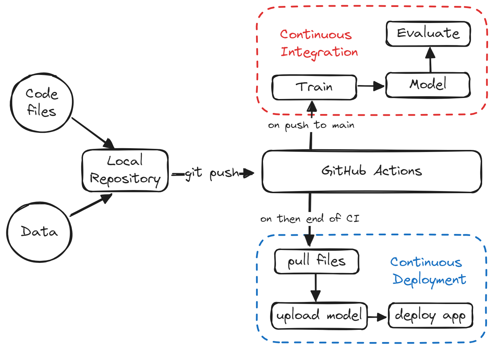

# A Beginner's Guide to CI/CD for Machine Learning
 Learn how to automate model training, evaluation, versioning, and deployment using GitHub Actions with the easiest MLOps guide available online.

# Drug Classification CI/CD Pipeline with GitHub Actions

This repository provides a beginner-friendly guide to setting up a CI/CD pipeline for a machine learning project using GitHub Actions. This project automates the process of training, evaluating, versioning, and deploying a drug classification model built with a random forest algorithm using scikit-learn. The app is deployed to Hugging Face Spaces, using GitHub Actions for a fully automated pipeline.

## Project Overview

This guide will help you:
- Automate model training and evaluation with CI/CD practices.
- Deploy a machine learning model and application to Hugging Face Spaces.
- Use GitHub Actions, Makefile, CML, and Hugging Face CLI for automation.


## Key Features
1. **Continuous Integration (CI)**: Automates the training, evaluation, and performance metrics logging for the model.
2. **Continuous Deployment (CD)**: Automatically deploys updated models to Hugging Face Spaces when new changes are pushed.
3. **Reproducible Pipelines**: Ensures reproducibility by using scikit-learn pipelines, CML for automated report generation, and GitHub Actions for CI/CD workflows.

## Project Structure

- `App/`: Contains the app files for deployment (e.g., `drug_app.py`, `README.md`, `requirements.txt`).
- `Data/`: Stores the dataset CSV files.
- `Model/`: Saves trained models and versioned updates.
- `Results/`: Holds evaluation results, metrics, and plots.

## Setup Instructions

### Prerequisites
1. **GitHub Account**: [Create a GitHub account](https://github.com/) if you don’t have one.
2. **Hugging Face Account**: [Create a Hugging Face account](https://huggingface.co/join) and obtain an access token with write permissions.
3. **Kaggle Dataset**: Download the Drug Classification dataset from Kaggle.

### Steps to Set Up Locally
1. Clone the repository:

   ```bash
   git clone https://github.com/kingabzpro/CICD-for-Machine-Learning.git
   ```

2. Install the dependencies:

   ```bash
   pip install -r requirements.txt
   ```

3. Set up your environment variables, GitHub secrets, and Hugging Face token as per instructions.

4. Run the app locally for testing:

   ```bash
   python ./App/drug_app.py
   ```

### Creating the CI/CD Pipeline

#### Continuous Integration (CI)
The CI pipeline runs whenever new code is pushed to the main branch, triggering:
1. **Code Formatting** using `black`.
2. **Model Training** with `train.py`.
3. **Evaluation and Report Generation** with CML.

#### Continuous Deployment (CD)
The CD pipeline deploys the app and model updates to Hugging Face Spaces after successful CI completion. The `cd.yml` workflow pulls the latest version, logs into Hugging Face CLI, and uploads files to the designated Space.

## Usage

1. Push code updates to the main branch.
2. CI Pipeline will:
   - Format code
   - Train the model
   - Generate and log metrics
3. CD Pipeline will:
   - Deploy the app and model updates to Hugging Face Space

## Project Files

- `Makefile`: Defines commands for CI/CD actions.
- `train.py`: Python script for data loading, model training, evaluation, and saving results.
- `ci.yml` & `cd.yml`: GitHub Action workflows for CI/CD automation.

## Dependencies
- `scikit-learn`
- `gradio`
- `skops`
- `CML`

For detailed requirements, see `requirements.txt`.

## Conclusion

This project demonstrates how to set up a CI/CD pipeline for machine learning using GitHub Actions, automating the model lifecycle from training to deployment. This setup helps ensure that every update is automatically evaluated and deployed, saving time and effort.

-----
title: Drug Classification
emoji: 🐠
colorFrom: gray
colorTo: blue
sdk: gradio
sdk_version: 5.5.0
app_file: app.py
pinned: false
license: apache-2.0